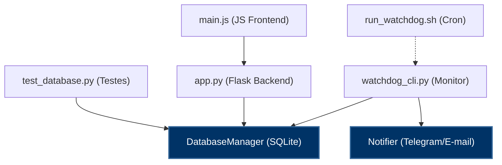

# 📐 Documento de Arquitetura - C.Vale Watchdog Agrocenter

Este documento detalha o desenho de arquitetura de software, fluxos de dados e as tecnologias adotadas para garantir que o Watchdog monitore com segurança e resiliência o portal **Agrocenter C.Vale**.

---

## 🏛️ 1. Arquitetura Lógica Geral

O sistema é construído sobre três pilares de negócio:
1. **Comunicação Eficiente**: Plataforma com Dashboard centralizado e alertas nos canais Telegram e E-mail. A comunicação segue uma política rígida de **Nível de Acionamento** para evitar sobrecarga de alertas no primeiro sinal de erro.
2. **Processos Otimizados**: Escalação segmentada por falhas consecutivas e distinção clara entre contatos de **TI** e **NEGÓCIO**. Contatos de gerência e diretoria (como o Chefe da TI) só são importunados quando os incidentes persistirem e escalarem de gravidade.
3. **Tecnologia Habilitadora**: Arquitetura leve baseada em Cron (execução episódica, zero RAM em idle) rodando no Alpine Linux.

---

## 🔄 2. Fluxo Geral de Dados e Processos

O diagrama abaixo ilustra o ciclo de vida de uma verificação e o fluxo de escalação multinível:

```text
[ CRONTAB ] (A cada 3 minutos)
    │
    ▼
[ watchdog_cli.py ]
    │
    ├──► 1. Checa Link Local (ISP Offline?) ──► [SIM] ──► Grava log "ISP Offline" e suspende alertas (Bypass)
    │
    ├──► 2. Checa Resolução DNS do Agrocenter
    │         │
    │         └──► [FALHA] ──► Consulta sockets UDP externos (1.1.1.1 / 8.8.8.8) ──► HTTPS via IP
    │
    ▼
[ Validação HTTP e de Assinaturas ]
    │
    ├──► Status Code 200 OK + Assinaturas Válidas
    │         │
    │         └──► [SIM] ──► Registra Log "Saudável" ──► Se havia incidente ativo, resolve e notifica TODOS
    │
    └──► [NÃO] (Erro WAF/Akamai, Erro de Banco ou Timeout)
              │
              └──► Incrementa contador de falhas consecutivas no SQLite
                        │
                        ▼
            [ AVALIAÇÃO DA POLÍTICA DE ESCALAÇÃO ]
                        │
                        ├──► Nível 1 (Operacional TI - Padrão 15 min / 5 falhas)
                        ├──► Nível 2 (Analista / Coordenação - Padrão 60 min / 20 falhas)
                        ├──► Nível 3 (Gerência - Padrão 150 min / 50 falhas)
                        └──► Nível 4 (Diretoria - Padrão 720 min / 240 falhas)
```

⚠️ *Nota: Por decisão de negócio e simplificação operacional, qualquer disparo de alerta ativo ou resolução é transmitido globalmente para todos os destinatários habilitados no `contacts.json`, garantindo alinhamento total de todas as equipes.*

---

## ⚙️ 3. Componentes Detalhados

### 3.1. Resolvedor Resiliente e Bypass de DNS
Caso o resolvedor de DNS local (Pi-hole, Unbound ou DNS interno da filial) apresente instabilidade, o monitor não acusa falha de forma ingênua.
1. O CLI tenta obter o IP da URL `prd-agrocenter.cvale.com.br`.
2. Se falhar, realiza uma query direta via socket UDP nativo para servidores externos do Cloudflare (`1.1.1.1`) ou Google (`8.8.8.8`).
3. Ao resolver o IP externamente, a chamada HTTPS é feita diretamente ao IP obtido. Para passar pelo WAF da Akamai, injetamos manualmente o cabeçalho `Host: prd-agrocenter.cvale.com.br` na requisição e desativamos o alerta SSL de nome incorreto.

### 3.2. Diferenciação de Falhas (ISP Local vs Portal Remoto)
- **Falha de ISP (Internet Local Caída)**: O Watchdog faz um teste inicial enviando uma requisição `HEAD` rápida para sites globais (Cloudflare/Google). Se esses sites estiverem inacessíveis, presume-se que a internet do Raspberry Pi caiu. O log é gravado no banco SQLite como `"Falha de Conectividade Local (Sem Internet - ISP Offline)"`, mas **nenhum e-mail ou alerta de Telegram é disparado**.
- **Falha Remota (Agrocenter Fora do Ar)**: Se a internet local estiver ativa mas o Agrocenter não responder ou violar as assinaturas, o sistema inicia o ciclo de abertura de incidente e escalação.

### 3.3. Banco de Dados (SQLite)
Usamos o SQLite em modo concorrente. O banco armazena logs detalhados e o controle de incidentes.
- A tabela `settings` armazena os limites de tempo de cada nível dinamicamente, permitindo a customização das regras de SLA diretamente pelo site.
- A data e a hora limite das buscas de KPIs são calculadas em Python e passadas como parâmetros nas queries para evitar qualquer conflito de timezone entre o fuso do sistema operacional e o SQLite.
- Mantemos todo o histórico de logs brutos e de incidentes de indisponibilidade gravados indefinidamente na base de dados, permitindo consultas históricas completas sem expurgos automáticos.

### 3.4. Escalação por Níveis de Acionamento e Contatos
A lista de destinatários em `contacts.json` contém campos de controle como:
- `level` (Nível de Acionamento correspondente):
  - **Nível 1**: Operacional TI
  - **Nível 2**: Analista / Coordenação
  - **Nível 3**: Gerência
  - **Nível 4**: Diretoria
- `department` (TI / NEGOCIO): Usado para categorização e histórico dos destinatários cadastrados.

> [!NOTE]
> Os disparos são simplificados: qualquer contato habilitado (`enabled: true`) em `contacts.json` receberá todos os alertas de incidente e de restabelecimento (resolução), mantendo as equipes técnica e operacional em sintonia constante.

---

## 🛠️ 4. Stack Tecnológica Utilizada

O projeto utiliza um conjunto de tecnologias de ponta, robustas e extremamente eficientes no consumo de hardware:

### 4.1. Core e Monitoramento (CLI Daemon)
- **Python 3.12+**: Linguagem base do monitoramento.
- **urllib.request / socket**: Módulos nativos para requisições HTTPS resilientes e checagem de sockets UDP de DNS externo (evitando dependências externas complexas).
- **SQLite 3**: Banco de dados relacional embutido e serverless utilizado para persistir configurações dinâmicas de SLA, histórico de checagens (`monitor_logs`) e estados de incidentes ativos (`incidents`).
- **SMTP/smtplib**: Protocolo nativo de mensageria para despacho assíncrono de relatórios e alertas por e-mail.
- **Busybox Crontab (Alpine Linux)**: Agendamento nativo a nível de SO executado a cada 3 minutos para acionar o CLI de forma episódica, consumindo **zero RAM** quando inativo.

### 4.2. Painel Web de Monitoramento (Dashboard)
- **Flask 3.0+**: Micro-framework Python de alta performance para servir a API de dados e a interface.
- **HTML5 Semântico**: Estruturação semântica e acessível das views do painel.
- **CSS3 Vanilla**: Estilização rica inspirada em consoles de terminal retro-futuristas (tema hacker com efeito neon de fósforo verde/azul, barra de status pulsante, tabelas responsivas e modal de configuração integrado).
- **Javascript Vanilla (ES6)**: Controle reativo e assíncrono (AJAX/Fetch API) para atualização automática de gráficos de latência a cada 30 segundos, manipulação do CRUD de contatos e controle interativo do popup modal de limiares.
- **Chart.js**: Biblioteca JS de renderização de gráficos em HTML5 Canvas utilizada para exibir a latência histórica dos testes.

### 4.3. Infraestrutura e Hospedagem (Produção)
- **Raspberry Pi 3B**: Microcomputador de baixo custo de energia utilizado como servidor de monitoramento.
- **Alpine Linux (V3.20)**: Sistema operacional minimalista rodando em modo RAM (diskless), garantindo imunidade a corrupções de cartão SD e consumo total de memória RAM inferior a 50MB.
- **Werkzeug Server**: Servidor de aplicação integrado utilizado para o dashboard de monitoramento local na LAN interna.

---

## 🔍 5. Estrutura de Acoplamento e Grafo de Dependências (Análise Graphify)

Através da indexação e análise da árvore de sintaxe abstrata (AST) feita com a ferramenta **Graphify**, mapeamos as relações do codebase para identificar acoplamentos estruturais, módulos centrais e interações entre os componentes.



### 5.1. Abstrações Centrais (God Nodes)
As duas classes que atuam como os hubs centrais (pontes de integração) do sistema são:
1. **`DatabaseManager`** (24 conexões no grafo): Gerencia toda a persistência de logs, KPIs e incidentes. É o principal nó de acoplamento de dados do projeto, conectando o daemon de monitoramento (`watchdog_cli.py`), o painel Flask (`app.py`) e os testes unitários (`test_database.py`).
2. **`Notifier`** (19 conexões no grafo): Ponto único de saída para todas as notificações. Encapsula o envio de e-mails (`smtplib`) e mensagens no Telegram (`aiogram`), sendo acionado pelo CLI ao detectar alterações de SLA e por scripts de diagnóstico.

### 5.2. Comunidades Funcionais (Coesão)
O grafo identificou comunidades lógicas de coesão, destacando:
*   **Comunidade 0 (`watchdog_cli.py`)**: Concentra a lógica de ISP local, resolvedor DNS UDP nativo, validação de assinaturas de payload e o loop principal do daemon. Com uma coesão de 0.08, sinaliza que esta classe concentra muitas responsabilidades, sendo elegível para refatoração (ex: isolar o resolvedor DNS).
*   **Comunidade 1 (`Notifier`)**: Engloba as regras de notificação, formatação de templates em HTML e testes de SMTP mockado.
*   **Comunidade 2 (`app.py`) & Comunidade 3 (`DatabaseManager`)**: Agrupam as rotas REST do Flask de latência e saúde do sistema que servem dados brutos para o dashboard.
*   **Comunidade 4 (`main.js`)**: Agrupa toda a reatividade do terminal retro-futurista (DOM, Fetch API, Chart.js e CRUD).

### 5.3. Orquestração de Infraestrutura (Scripts Bash)
Os scripts bash (`setup_alpine.sh`, `run_watchdog.sh`, `keepalive_dashboard.sh` e `log_resources.sh`) aparecem como nós fracamente conectados na análise estritamente Python. No entanto, eles realizam a amarração física da aplicação com o Alpine Linux no Raspberry Pi, garantindo a carga de variáveis de ambiente, ativação do ambiente virtual (`venv`) e a auto-recuperação do serviço de dashboard em produção.


