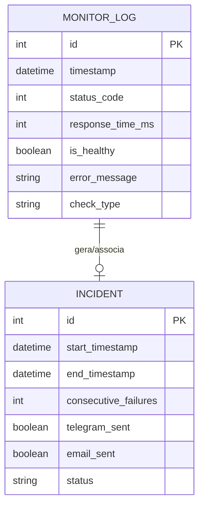

# Watchdog Agrocenter - Ideação e Arquitetura

Este projeto consiste em um sistema de Watchdog minimalista e resiliente para monitorar a integridade e disponibilidade do serviço Agrocenter. Projetado para rodar em hardware de baixo consumo (Raspberry Pi 3B com Alpine Linux) e integrado com notificações em tempo real (Telegram e E-mail) e um dashboard local em Flask para acompanhamento.

---

## 1. Alinhamento com os Três Pilares

O projeto está estruturado em torno dos três pilares estratégicos de resolução de falhas:

1. **Comunicação Eficiente (Plataforma Centralizada)**
   - Notificações imediatas via **Telegram** (usando `aiogram`) para eventos de falha e restabelecimento.
   - Escalação via **E-mail** (template em HTML personalizado nas cores Azul Cobalto e Branco) para uma lista de contatos persistente em caso de falhas consecutivas.
   - Dashboard Flask simulando mini-terminais retrô (nerd) com KPIs de disponibilidade.

2. **Processos Otimizados (Fluxo e Resiliência)**
   - O Watchdog executa de forma periódica via **cron**.
   - Armazenamento de métricas e histórico de incidentes em banco local **SQLite** de baixo overhead.
   - Lógica de persistência de falhas para evitar alarmes falsos e escalonamento inteligente (notifica Telegram no primeiro erro, e-mail após *N* falhas consecutivas).

3. **Tecnologia Habilitadora (Hardware e Sistemas)**
   - Implementação focada em **Alpine Linux** rodando no **Raspberry Pi 3B** para garantir consumo mínimo de RAM e CPU.
   - Monitoramento HTTP inteligente (validação de tempo de resposta, cabeçalhos, e conteúdo de backend, não apenas o status code 200).

---

## 2. Modelo Entidade-Relacionamento (MER)

O banco de dados SQLite (`database.db`) possui duas tabelas principais para rastreamento de disponibilidade e gerenciamento de incidentes:



### Detalhes das Tabelas:
- **`monitor_logs`**: Registra cada execução do cron.
  - `id` (INTEGER PRIMARY KEY AUTOINCREMENT)
  - `timestamp` (DATETIME DEFAULT CURRENT_TIMESTAMP)
  - `status_code` (INTEGER)
  - `response_time_ms` (INTEGER)
  - `is_healthy` (BOOLEAN)
  - `error_message` (TEXT)
  - `check_type` (TEXT) - Ex: 'HTTP', 'TCP'
- **`incidents`**: Registra o ciclo de vida de uma queda de serviço.
  - `id` (INTEGER PRIMARY KEY AUTOINCREMENT)
  - `start_timestamp` (DATETIME DEFAULT CURRENT_TIMESTAMP)
  - `end_timestamp` (DATETIME)
  - `consecutive_failures` (INTEGER)
  - `telegram_sent` (BOOLEAN DEFAULT 0)
  - `email_sent` (BOOLEAN DEFAULT 0)
  - `status` (TEXT) - Ex: 'ACTIVE', 'RESOLVED'

---

## 3. Fluxo do Watchdog (Cron Execution)

1. O **Cron** aciona o script `watchdog_cli.py` a cada *X* minutos.
2. O script realiza a chamada HTTP para o Agrocenter.
3. **Validação de Premissas**:
   - Status HTTP deve ser 200.
   - O tempo de resposta deve ser < `TIMEOUT` configurado.
   - O corpo da resposta deve conter/não conter determinadas palavras-chave (ex: evitar páginas de erro customizadas do Cloudflare/Firewall disfarçadas de 200).
4. Se o teste passar:
   - Salva status como saudável.
   - Se houver um incidente `ACTIVE` aberto, fecha o incidente (marca `end_timestamp` e altera status para `RESOLVED`) e envia notificação de "Serviço Restabelecido" no Telegram.
5. Se o teste falhar:
   - Salva log de falha.
   - Se não houver incidente `ACTIVE`, cria um novo incidente, envia alerta imediato via Telegram.
   - Se o incidente já existir, incrementa `consecutive_failures`.
   - Se `consecutive_failures` atingir o limite limite de tolerância (ex: 3 falhas consecutivas), envia notificação por e-mail para a lista de contatos do JSON.

---

## 4. Estrutura do Repositório

```text
11_WATCHDOG_AGROCENTER/
├── assets/                  # Logos (C.Vale), ícones e imagens do Dashboard
├── docs/                    # Documentação técnica e guias de comissionamento
├── logs/                    # Arquivos de log de texto (.log)
├── src/
│   ├── watchdog/            # Core do Watchdog (script cron, banco de dados, alertas)
│   │   ├── __init__.py
│   │   ├── database.py      # Operações SQLite
│   │   ├── notifier.py      # Envio de Telegram e E-mail
│   │   └── watchdog_cli.py  # Script de execução principal
│   └── dashboard/           # Dashboard Web Flask (KPIs e Terminais)
│       ├── __init__.py
│       ├── app.py
│       ├── templates/
│       │   └── index.html   # Tema Nerd / Terminal retrô
│       └── static/
│           ├── css/
│           │   └── style.css
│           └── js/
│               └── main.js
├── tests/                   # Testes unitários e de integração
├── scripts/                 # Scripts auxiliares (instalação, cron setup, migrações)
│   ├── setup_alpine.sh      # Instalação minimalista no Alpine Linux
│   └── run_watchdog.sh      # Script invocado pelo Cron (carrega envs e venv)
├── knowledge/               # Documentações de referência e guias de troubleshooting
├── skills/                  # Recursos para estender funcionalidades do agente
├── .env.example             # Template de configurações
├── .gitignore
├── idea.md                  # Este documento
├── readme.md                # Instruções de setup
└── requirements.txt         # Dependências do projeto
```

---

## 5. Roadmap e Completude

| ID | Tarefa / Etapa | % Completo | Responsável / Nota |
|:---|:---|:---:|:---|
| 1 | Arquitetura, Ideação (`idea.md`) e Estrutura de Pastas | 100% | Antigravity |
| 2 | Modelagem de Banco de Dados e Scripts SQLite (`src/watchdog/database.py`) | 0% | Pendente |
| 3 | Core do Watchdog & Validador de Premissas HTTP (`src/watchdog/watchdog_cli.py`) | 0% | Pendente |
| 4 | Módulo de Alerta Telegram (`aiogram`) e E-mail (`smtplib`) | 0% | Pendente |
| 5 | Criação do Template de E-mail (Azul Cobalto + Branco) | 0% | Pendente |
| 6 | Download e Configuração do Logo C.Vale nos `assets` | 0% | Pendente (fazer download do logo público C.Vale ou mockup) |
| 7 | Dashboard Flask com Mini-Terminais Nerd e KPIs | 0% | Pendente |
| 8 | Scripts de Comissionamento e Automatização para Alpine Linux (`scripts/setup_alpine.sh`) | 0% | Pendente |
| 9 | Implementação de Testes Unitários (`tests/`) | 0% | Pendente |
| 10| Configuração final do Git, README.md, .env e venv | 0% | Pendente |

---
